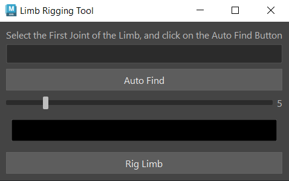

# Maya Plugins

This is a collection of maya plugins to help with rigging and other stuff

# How to intall:
drag the install.mel file into maya's viewport, and the tools will apear on the current shelf.

## Limb Rigger

Rigs any 3 joint limb.

* Auto find the joints
* Control the controller size
* Control the controller color
* Modular aproach
* Set color of any selected controller

